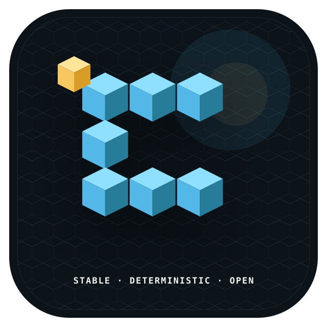
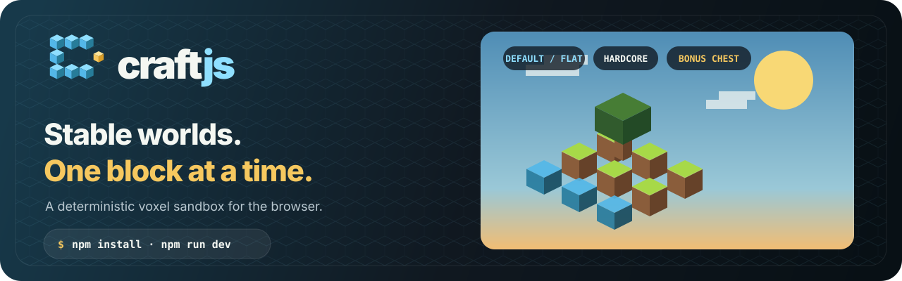

<p align="center">
  
</p>

<p align="center">
  
</p>

<p align="center"><strong>Stable worlds. One block at a time.</strong></p>

<p align="center">
  <a href="#quick-start">Quick start</a> ·
  <a href="#gameplay-baseline">Gameplay</a> ·
  <a href="#architecture">Architecture</a> ·
  <a href="#testing">Testing</a> ·
  <a href="#brand">Brand</a>
</p>

<p align="center">
  
</p>

Craftjs is a minimal, deterministic voxel sandbox engine for the browser. It is
built around stability and correctness rather than feature count: an
effectively unbounded world, streamed and meshed off the main thread, with a
fixed-timestep simulation that behaves identically on any hardware.

## Quick start

```bash
npm install
npm run dev
```

Open the printed URL, name the world, choose its seed, mode and generator
options, then click Play.

| Script | Purpose |
| --- | --- |
| `npm run dev` | Development server with hot reload |
| `npm run build` | Typecheck, then emit a static bundle to `dist/` |
| `npm run preview` | Serve the production bundle locally |
| `npm run serve` | Serve `dist/` with the optional multiplayer relay |
| `npm test` | Run the test suite |
| `npm run typecheck` | Typecheck without emitting |

`dist/` is a fully static single-player site — no server and no external asset
requests. World textures and dropped-item sprites are generated procedurally;
inventory artwork ships as local SVG pixel assets. Multiplayer is optional:
`npm run dev` includes a room relay for development, while `npm run build &&
npm run serve` serves the production bundle and relay together.

## Controls

| Action | Input |
| --- | --- |
| Move | `W` `A` `S` `D` |
| Jump / ascend | `Space` |
| Sneak / descend | `Shift` |
| Sprint | `Ctrl` |
| Toggle flight | `F` |
| Break block | Left click |
| Place block | Right click |
| Select block | `1`–`9`, mouse wheel |
| Inventory / quick crafting | `E` |
| Debug overlay | `F3` |
| Pause | `Esc` |

Query parameters: `?seed=<number|text>` picks a world, `?distance=<2–16>` sets
render distance. Each seed is a separate save — switching between them keeps
both intact. With no `?seed`, the last world played is reopened.

## Gameplay baseline

- Survival inventory: mined blocks are collected, placement consumes one, and
  four small recipes cover planks, cobblestone, bricks and glass.
- Creative inventory: 126 typed catalogue items, every buildable block and nine
  mob spawn eggs are available from `E` in fixed 27-slot pages above a separate
  nine-slot hotbar. Click an item to equip the selected hotbar slot.
- World creation supports Survival, Creative and permanent-death Hardcore,
  Default or Flat terrain, and independent Structures and Bonus Chest options.
  Those choices are immutable metadata: reopening a seed uses its saved
  configuration rather than current menu defaults.
- The day/night cycle, weather and inventory are saved with the world.
- Named-world management is a separate application service: create/open,
  rename, delete and last-played ordering operate on stable world ids, so two
  worlds may intentionally share one terrain seed without sharing edits.
- The PSP-era creature catalogue includes Pig, Cow, Chicken, Sheep, Zombie,
  Spider, Skeleton, Creeper and Cave Spider. Death rolls typed loot into
  physical, bounded-lifetime item stacks that settle on terrain and must be
  collected after a short pickup delay.
- Rain is one depth-tested world-space line field, not a screen overlay. It has
  perspective and parallax while staying bounded to one draw call.
- Multiplayer rooms sync player presence and block edits. They intentionally do
  not add accounts, chat, PvP or a permanent authoritative world server.

## Architecture

Domain-driven design with a strict dependency rule: **dependencies point
inward only.** The domain knows nothing about Three.js, the DOM, IndexedDB or
Web Workers, so the game rules are testable in isolation and any adapter can be
replaced without touching them.

```
src/
├── domain/            No external dependencies. Pure rules and data.
│   ├── world/         Block registry, Chunk, World aggregate, coordinates
│   ├── generation/    Deterministic noise and terrain synthesis
│   ├── physics/       AABB collision resolution, voxel raycasting
│   ├── player/        Player entity, intent, movement rules
│   ├── entity/        Creature catalogue, brains, spawning, loot, item drops
│   ├── inventory/     Items, bounded inventory, atomic recipes
│   └── shared/        Value objects
├── application/       Use cases and ports. Depends only on domain.
│   ├── ports/         Interfaces the outside world must satisfy
│   ├── services/      Streaming, editing, entities, world management
│   ├── GameLoop.ts    Fixed-timestep loop with interpolated rendering
│   └── Game.ts        Composition root and frame orchestration
├── infrastructure/    Adapters. Depends on application + domain.
│   ├── rendering/     Three.js renderer, procedural texture array, shaders
│   ├── network/       Optional reconnecting WebSocket room adapter
│   ├── meshing/       Greedy-free culled mesher, worker pool
│   ├── input/         Keyboard + pointer-lock adapter
│   └── persistence/   IndexedDB catalog/repositories and memory doubles
└── presentation/      DOM HUD and bootstrap
```

### Ports

Every boundary the application crosses is an interface in
`application/ports/`: `GameRenderer`, `InputSource`, `ChunkMesher`,
`WorldRepository`, `WorldCatalog`. The integration tests drive the real
services against in-memory doubles, with no browser present.

### World generation presets

`ChunkStreamer` depends on the domain `ChunkGenerator` strategy, not on menu
state. Default terrain uses the existing deterministic heightfield generator.
Flat terrain has a fixed layer stack: bedrock at y=0, stone at y=1–43, dirt at
y=44–46, grass at y=47, and air above. Optional generation decorators add one
seeded safe ruin and one seeded starter chest; disabling either decorator
produces none.

## Design decisions

**Fixed-timestep simulation, interpolated rendering.** Physics always advances
in exact `1/60 s` increments, so behaviour never depends on frame rate. The
renderer interpolates between the last two states, so motion stays smooth on
displays that do not divide evenly into the tick rate. The loop caps steps per
frame and clamps frame delta: without both, one slow frame causes more work on
the next, which causes a slower frame — a spiral that locks up the page.

**Everything per-frame is budgeted.** Terrain generation gets a millisecond
budget, mesh jobs are capped by worker capacity, GPU uploads by a fixed count.
Frame time stays flat while the player moves instead of spiking at every chunk
boundary.

**Meshing runs in workers.** Turning voxels into geometry is by far the most
expensive operation; on the main thread it is the hitch you see when terrain
streams in. Each job receives a self-contained padded volume — the chunk plus a
one-block skirt of its neighbours — so the worker needs no world access and the
buffer can be transferred instead of copied. If workers are unavailable or a
worker dies, the pool degrades to synchronous meshing rather than leaving the
world invisible.

**Chunks mesh only once all eight neighbours are resident.** Face culling and
ambient occlusion both read across chunk borders. Meshing early would bake in
seams that are never cleaned up, so the load radius extends one chunk beyond
the render radius.

**Only edits are persisted.** Terrain is a pure function of `(coordinate,
seed, creation settings)`, so a save stores immutable creation metadata, the
player, and the delta between generated terrain and what the player built. A
world stays a few kilobytes no matter how far the player travels. Records are
namespaced by stable world id: without that, opening another world could
restore the previous player's position and replay its edits onto unrelated
terrain, corrupting both saves.

**World identity is not the seed.** A catalogue record owns a stable `WorldId`,
a mutable display name and immutable creation settings. Each id opens a
separately prefixed repository. Rename touches only the catalogue; delete
clears that repository before removing its discoverable record, so a failed
delete remains visible and retryable. `Game.save()` and `Game.saveAndExit()`
provide explicit session operations in addition to autosave.

**Creature rewards are data, not combat branches.** Creature definitions and
loot tables live in the domain. A fatal hit creates collectible item entities;
application code advances physics and pickup, while the renderer receives flat
item views in bounded instanced sprite layers, one per visible resource type.
Population and item-drop caps keep both simulation and GPU work bounded.

**Unloaded space is solid.** `World.isSolidAt` reports missing chunks as solid,
so a player can never fall through terrain that has not streamed in yet.

**Collision is axis-separated and sub-stepped.** Each axis resolves
independently, so contact with one surface never cancels motion along the
others — that is what makes walls slideable and corners non-sticky. Moves are
sub-stepped below one block, so nothing can tunnel through geometry no matter
how large the delta or how long a frame stalled.

**A texture array, not an atlas.** Each block texture is its own layer, so
filtering can never bleed one block's pixels into a neighbour along a shared
edge — the classic voxel atlas seam. Textures are generated procedurally, so
the build has no binary assets and the texture set can never drift out of sync
with the block registry.

**Lighting is baked into vertices.** Directional face shading multiplied by
ambient occlusion is computed once at mesh time and stored per vertex. Shading
costs a single multiply and is independent of how many chunks are on screen.

## Testing

185 tests covering the parts where correctness is not obvious by inspection:

- **Collision** — landing, sliding, ceilings, tunnelling at any speed, and an
  invariant sweep asserting the player never ends a step inside geometry.
- **Raycasting** — exact face normals, negative coordinates, grazing diagonals,
  degenerate directions.
- **Generation** — determinism across instances and repeat calls, bedrock
  floor, sea level, both presets, configuration serialization, deterministic
  structures and bonus-chest placement/loot, and that trees assemble into
  complete shapes when adjacent chunks are generated independently.
- **Meshing** — face culling, translucent separation, index bounds, ambient
  occlusion variance, index-type selection above 65 535 vertices.
- **Streaming** — load/render radii, the neighbour precondition, unload and
  mesh release, bounded residency over a long walk, edit-driven rebuilds of
  border chunks, persistence round-trips, and recovery from repository and
  mesher failures.
- **Game loop** — fixed step size, single render per frame, spiral prevention,
  suspended-tab clamping.
- **Game lifecycle** — spawn placement, look input applied once per frame
  regardless of tick count, break/place rules, save/restore round-trips,
  one-time starter loot, Hardcore death/reload/delete semantics, recovery from
  a snapshot that would bury or NaN the player, explicit save-and-exit and
  clean disposal.
- **World management** — same-seed isolation, named-world ordering,
  rename-without-generator-mutation, scoped deletion, legacy registration and
  retryable delete failures.
- **Creature rewards** — the nine-creature catalogue, deterministic typed loot,
  physical drop pickup delay, resource-item persistence and reward coverage
  for every spawnable creature.
- **Inventory catalogue** — all 126 typed items, nine spawn eggs, large-save
  round-trips, complete SVG coverage for all 146 creative entries, and a check
  that transformed icons contain vector pixels rather than embedded rasters.

```bash
npm test
```

## Brand

The Craftjs identity is **the open chunk**: seven blue voxel cubes form an open
`C`, with one gold cube representing the player's next intentional change. The
production logo system, color tokens, voice, accessibility rules and export
guidance live in the [brand guidelines](assets/brand/BRAND.md).

## Extending

Adding a block type is one entry in `domain/world/BlockType.ts` plus a painter
in `infrastructure/rendering/TextureAtlas.ts`; culling, physics, targeting and
the hotbar all read from the registry. Block ids are persisted, so append new
ones rather than renumbering.

Swapping an adapter means implementing the matching port — a server-backed
`WorldRepository`, a gamepad `InputSource`, or a different `GameRenderer` — and
changing the wiring in `src/main.ts`. Nothing in `domain/` or `application/`
changes.
